# Windows Enterprise PKI & Certificate Trust Lab

[](https://github.com/Mighiana/Windows-enterprise-pk/actions/workflows/ci.yml)


An Active Directory-integrated public key infrastructure built on Windows Server 2022.
An AD CS **Enterprise Root CA** issues a machine certificate. **Group Policy** distributes
trust in that root. **IIS** serves HTTPS with the issued certificate, and Microsoft Edge connects
to `https://server.irb.local` with **no certificate warning**.

| Edge: connection is secure | Chain ends at the enterprise root | IIS `https :443` binding |
|---|---|---|
| 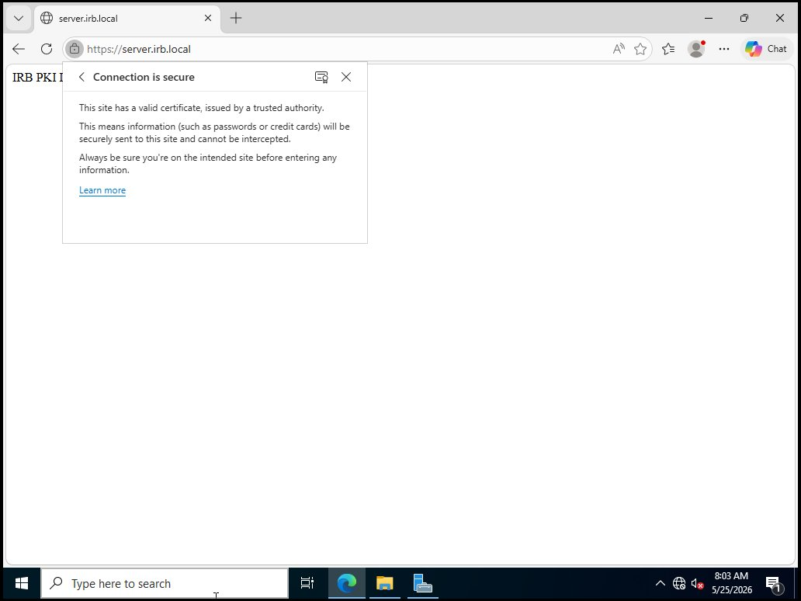 | 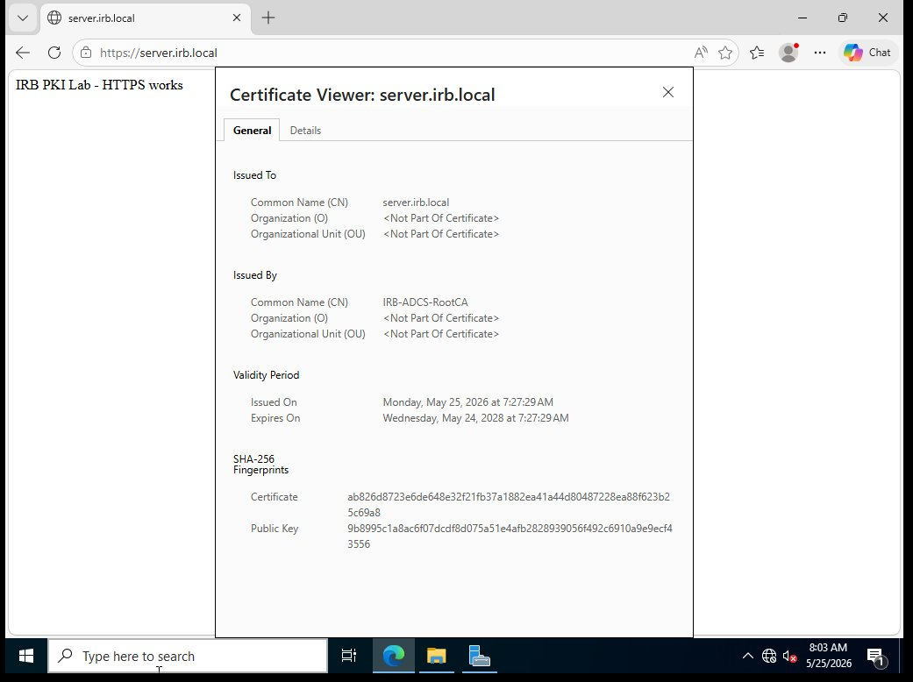 | 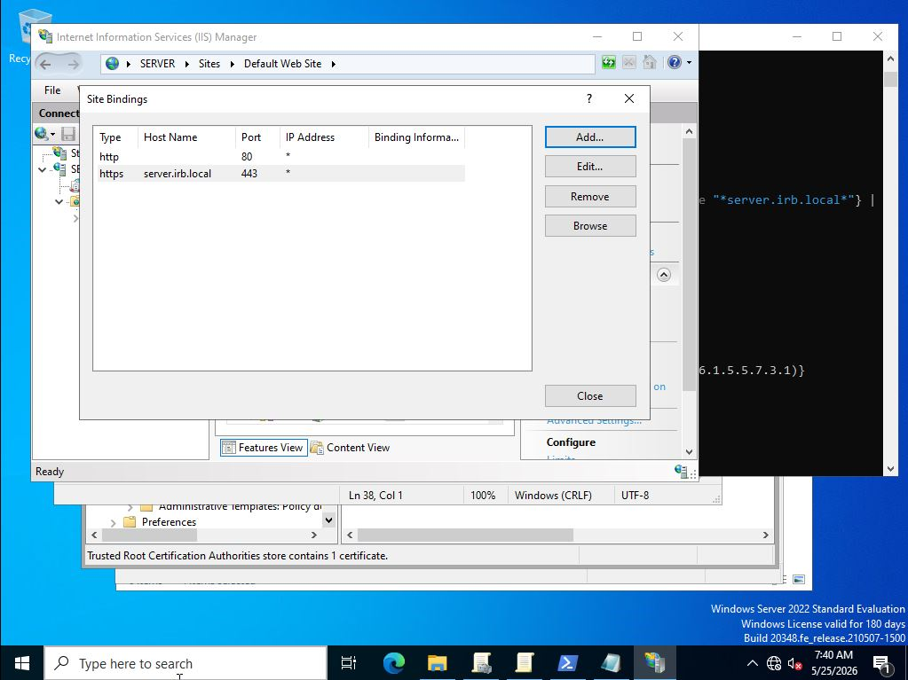 |

> **Provenance.** This repository documents and reproduces a Windows Enterprise PKI lab
> originally completed in **May 2026** as part of university coursework. The original
> implementation was performed manually in Windows Server 2022 and is preserved through the
> accompanying lab evidence. The repository itself was created later (October 2026) to
> organize the documentation and provide a reproducible portfolio version of the environment.
> Everything under [`scripts/`](scripts/), [`tests/`](tests/) and [`tools/`](tools/), plus the
> [target design](docs/target-architecture.md), is a **2026 extension** and was **not** part of
> the original lab. In October 2026 the lab was also **rebuilt live on two VMs** (server + separate
> domain client) to test what the original could not show: see [Live two-VM rebuild](#live-two-vm-rebuild-2026).
> See [Repository provenance](#repository-provenance).

## What this project shows

| Skill | Where |
|---|---|
| Building an AD-integrated PKI: AD DS, DNS, Enterprise Root CA, GPO trust, IIS TLS | [Original lab evidence](#active-directory-foundation) |
| GPO trust delivery verified on a **separate** domain-joined Windows 11 client | [Live rebuild](docs/live-lab.md#1-gpo-trust-on-a-separate-client) |
| Hardened certificate template + GPO **auto-enrollment** on server and client | [Live rebuild](docs/live-lab.md#2-hardened-template-and-gpo-auto-enrollment) |
| Certificate lifecycle: issue → verify → **revoke** → publish CRL → detect → replace → recover | [Live rebuild](docs/live-lab.md#3-revocation-lifecycle) |
| Explaining the trust chain end to end and what the evidence does **not** prove | [Validation evidence](#validation-evidence), [Limitations](#limitations) |
| Read-only PowerShell verification of every link of the chain, with an HTML report | [`verify-pki.ps1`](scripts/verify-pki.ps1), [Verification report](#verification-report-2026) |
| Offensive-aware AD CS review: ESC1-ESC4, ESC6, ESC8 mapped to MITRE ATT&CK, proven on a live CA by a controlled insecure → remediated matrix | [`audit-adcs.ps1`](scripts/audit-adcs.ps1), [AD CS security audit](#ad-cs-security-audit-2026), [audit matrix](docs/live-lab.md#4-ad-cs-audit-matrix-detection-and-remediation) |
| Production PKI design: offline root, issuing CA, CDP/OCSP, autoenrollment, HSM, monitoring | [Target design](#production-target-design-2026) |
| Engineering hygiene: 56 Pester tests, PSScriptAnalyzer, CI on PowerShell 7 and 5.1, privacy-sanitized evidence | [Reproducibility](#reproducibility), [`original-lab/`](original-lab/README.md) |

## Contents

[Overview](#overview) · [Architecture](#architecture) · [Lab environment](#lab-environment) ·
[AD foundation](#active-directory-foundation) · [Root CA](#enterprise-root-ca) ·
[GPO trust](#trust-distribution-with-group-policy) · [Issuance](#certificate-request-and-issuance) ·
[IIS](#iis-https-configuration) · [Chain](#trust-chain-verification) · [Evidence](#validation-evidence) ·
[Security concepts](#security-concepts-demonstrated) · [AD CS audit](#ad-cs-security-audit-2026) ·
[Live rebuild](#live-two-vm-rebuild-2026) · [Report](#verification-report-2026) · [Target design](#production-target-design-2026) ·
[Screenshots](#screenshots) · [Reproducibility](#reproducibility) · [Decisions](#lessons--technical-decisions) ·
[Limitations](#limitations) · [Provenance](#repository-provenance)

---

## Overview

| | |
|---|---|
| **Domain** | `irb.local` (lab-only domain) |
| **Server** | `server.irb.local`: Windows Server 2022 Standard (evaluation), single VM |
| **Roles** | AD DS · DNS · AD CS (Certification Authority) · IIS |
| **CA** | `IRB-ADCS-RootCA`: Enterprise Root CA, self-signed, valid to 2036-05-25 |
| **Trust GPO** | `IRB Root CA Trust`, linked to `irb.local` |
| **Service certificate** | `CN=server.irb.local`, SAN `DNS=server.irb.local`, valid 2026-05-25 → 2028-05-24 |
| **Endpoint** | IIS *Default Web Site*, `https` · `server.irb.local` · `:443` |
| **Result** | Edge: *"Connection is secure: valid certificate, issued by a trusted authority"* |

## Problem / security goal

Enterprise environments need an internal trust model to authenticate services and encrypt
internal traffic. Trusting individual self-signed certificates one by one doesn't scale.

This lab implements an AD-integrated PKI with AD CS. It distributes trust in the root CA through
Group Policy, issues a machine certificate to a domain server, binds that certificate to IIS and
verifies that the client trusts the HTTPS service without certificate warnings.

It is a **lab** PKI that demonstrates the trust chain end to end. It is **not** a production PKI design
(see [Limitations](#limitations)).

## Architecture

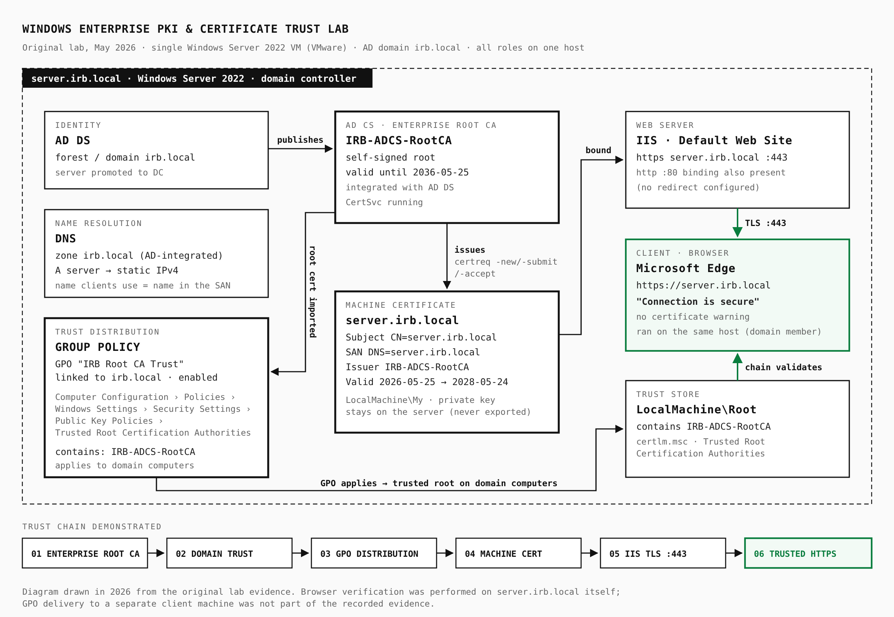

```
ACTIVE DIRECTORY DOMAIN  irb.local          (all roles on server.irb.local, Windows Server 2022)
        │
        ├── DNS ─────────────── A  server.irb.local → static IPv4
        │
        ├── GROUP POLICY ─────  GPO "IRB Root CA Trust" (linked to irb.local)
        │        └── Trusted Root Certification Authorities ← IRB-ADCS-RootCA
        │
        └── AD CS  ENTERPRISE ROOT CA  IRB-ADCS-RootCA
                 │ issues (certreq)
                 ▼
          SERVER CERTIFICATE  CN / SAN = server.irb.local   (LocalMachine\My + private key)
                 │ bound
                 ▼
          IIS  Default Web Site  https :443
                 │ TLS
                 ▼
          DOMAIN MEMBER / EDGE  https://server.irb.local   (same host in this lab)
                 │
                 ▼
          TRUSTED CONNECTION: chain ends at IRB-ADCS-RootCA, no warning
```

Source: [`docs/architecture.svg`](docs/architecture.svg). Details: [`docs/lab-overview.md`](docs/lab-overview.md).

## Lab environment

| Component | Value (from the original lab evidence) |
|---|---|
| Hypervisor | VMware (single VM, NAT network) |
| OS | Windows Server 2022 Standard Evaluation, build 20348 |
| Host name / FQDN | `server` / `server.irb.local` |
| Addressing | Static private IPv4, DHCP disabled, DNS server = `127.0.0.1` |
| Installed roles | AD CS, AD DS, DNS, File and Storage Services, IIS |
| Client used for verification | Microsoft Edge **on the same server** |

## Active Directory foundation

The server was given a static address, then promoted to the first domain controller of a new
forest, `irb.local`. AD-integrated DNS hosts the `irb.local` zone with the `server` A record.
That record matters later because the name clients resolve must match the certificate's SAN.

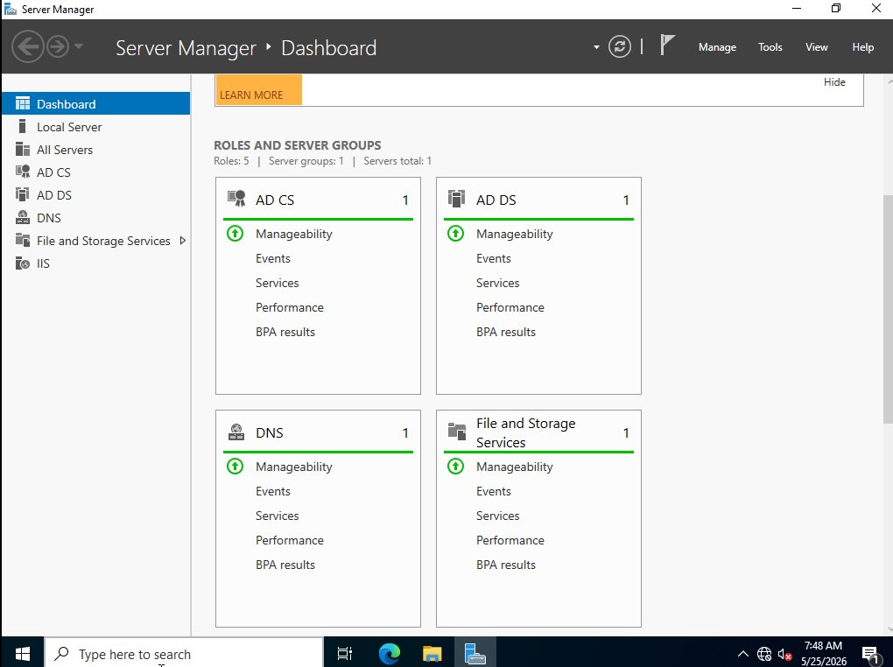

## Enterprise Root CA

AD CS was installed and configured as an **Enterprise Root CA** named `IRB-ADCS-RootCA`.
Because it is an *enterprise* CA, its configuration and root certificate are integrated with
Active Directory. That CA signed the IIS server certificate.

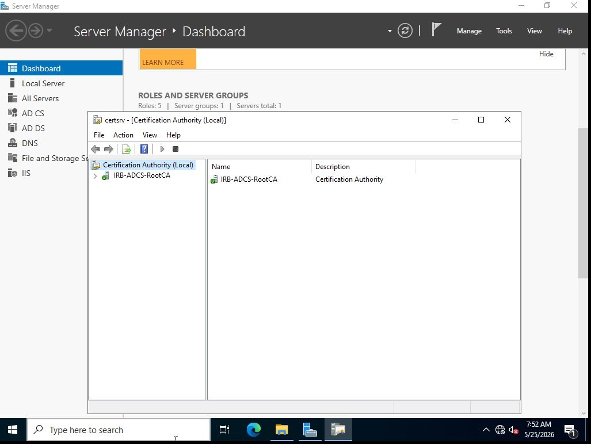

## Trust distribution with Group Policy

A dedicated GPO, **`IRB Root CA Trust`**, is linked to the `irb.local` domain (link enabled,
security filtering: *Authenticated Users*). The CA certificate was imported into:

```
Computer Configuration
 → Policies
   → Windows Settings
     → Security Settings
       → Public Key Policies
         → Trusted Root Certification Authorities
```

**Why it matters:** every domain-joined computer that applies the GPO trusts the enterprise CA
automatically. Nobody has to import the root by hand on each machine, and the trust decision is
managed centrally, so it can also be revoked centrally.

| GPO linked to the domain | Root CA inside the GPO |
|---|---|
| 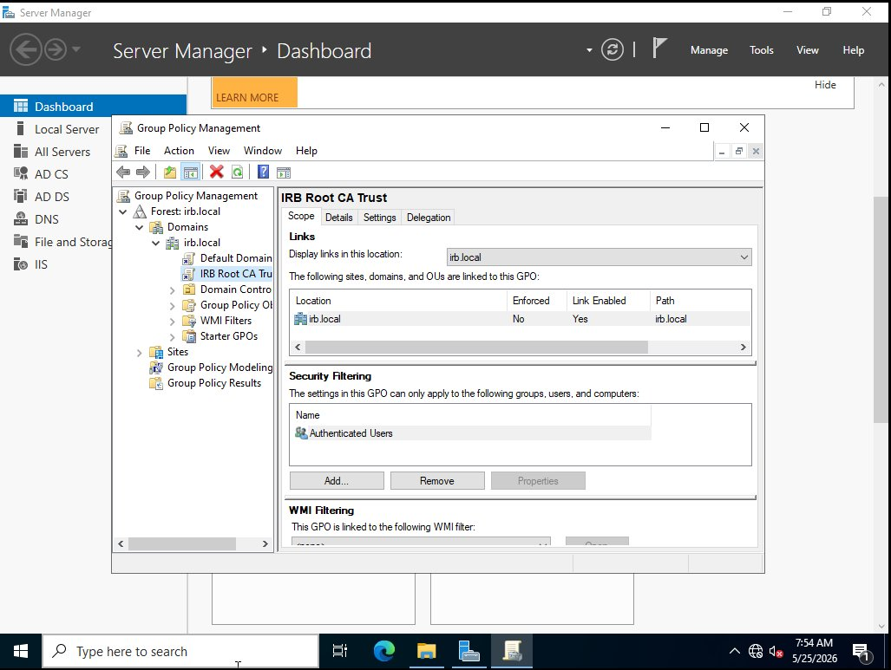 | 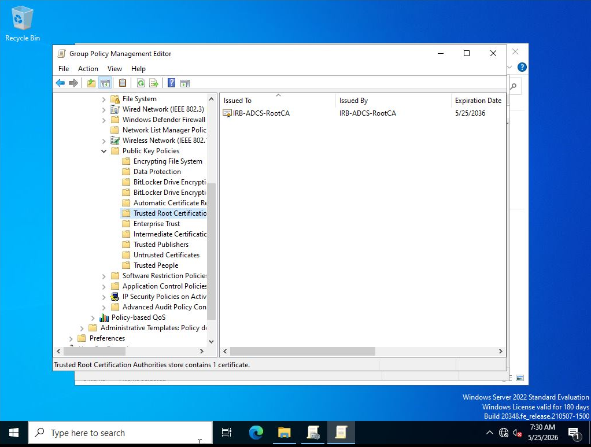 |

On the server, `certlm.msc` shows `IRB-ADCS-RootCA` in the local machine
*Trusted Root Certification Authorities* store.

> **Scope of the evidence:** the lab had a single VM, so the GPO effect was observed on the domain
> controller itself. Delivery to a *separate* domain client was not recorded. Certificate
> **auto-enrollment** was not configured; the server certificate was requested manually.

## Certificate request and issuance

The machine certificate was requested with **`certreq`** in the local-machine context:

| Field | Value |
|---|---|
| Subject | `CN=server.irb.local` |
| Subject Alternative Name | `DNS=server.irb.local` |
| Issuer | `IRB-ADCS-RootCA` |
| Validity | 2026-05-25 → 2028-05-24 |
| Store | `Cert:\LocalMachine\My` (Personal), linked to its private key after `certreq -accept` |

The original report does not record the certificate template or the INF file used.
This repository does not invent them.
[`scripts/reproduce/New-ServerCertificateRequest.ps1`](scripts/reproduce/New-ServerCertificateRequest.ps1)
is a 2026 reconstruction that produces the same Subject and SAN.

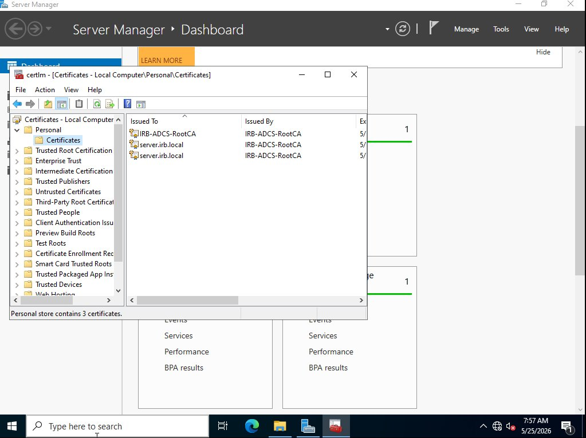

## IIS HTTPS configuration

The certificate was bound to the IIS **Default Web Site** as an `https` binding on port **443**
with host name `server.irb.local`. TLS then protects browser-to-server traffic. The original
`http :80` binding was left in place (see Limitations).


## Trust chain verification

Edge opened `https://server.irb.local` and showed
**"Connection is secure"** with no warning. The certificate viewer shows the chain ending at the
enterprise root.

| Connection is secure | Certificate viewer |
|---|---|
|  |  |

## Validation evidence

The evidence chain from the original lab, and the 2026 automated check that re-tests each link:

| # | Claim | Original evidence | `verify-pki.ps1` check |
|---|---|---|---|
| 01 | DNS resolves `server.irb.local` | [DNS A record](docs/screenshots/02-dns-a-record.png) | `DNS` · A record for server.irb.local |
| 02 | Enterprise Root CA is trusted | [Trusted Root store](docs/screenshots/06-local-machine-trusted-root-store.png), [GPO](docs/screenshots/05-gpo-trusted-root-ca.png) | `TRUST` · Root CA in LocalMachine\Root · Root delivered by Group Policy |
| 03 | Server certificate issued by `IRB-ADCS-RootCA` | [Personal store](docs/screenshots/07-machine-certificate-personal-store.png) | `CERT` · Issued by enterprise CA · Signed by trusted root |
| 04 | Subject / SAN match `server.irb.local` | [Certificate viewer](docs/screenshots/10-certificate-viewer-chain.png), report | `CERT` · Subject CN matches FQDN · SAN contains DNS name |
| 05 | Certificate installed with its private key | Personal store (key icon), report | `CERT` · Associated private key present |
| 06 | IIS uses the certificate on port 443 | [IIS bindings](docs/screenshots/08-iis-https-binding-443.png) | `IIS` · HTTPS binding · Bound certificate matches host name |
| 07 | Browser connects to `https://server.irb.local` | [Edge](docs/screenshots/09-edge-connection-secure.png) | `TLS` · TLS handshake · HTTPS response |
| 08 | No certificate warning | [Edge](docs/screenshots/09-edge-connection-secure.png) | `TLS` · Client trusts certificate (no warning) |
| 09 | Chain ends at the trusted enterprise root | [Certificate viewer](docs/screenshots/10-certificate-viewer-chain.png) | `TLS` · Served certificate = IIS-bound certificate |

## Security concepts demonstrated

- **PKI trust hierarchy:** a self-signed root anchors trust; the leaf is trusted only through it.
- **Enterprise Root CA:** an AD CS CA integrated with AD DS (vs. a standalone CA).
- **Certificate issuance:** CSR (PKCS#10) → CA signature → acceptance into the machine store.
- **Public/private key relationship:** the private key never leaves the server; the certificate binds the public key to a name.
- **Subject Alternative Name:** browsers validate the host name against the SAN, not the CN.
- **Certificate trust stores:** `LocalMachine\My` (service identity) vs. `LocalMachine\Root` (trust anchors).
- **Group Policy trust distribution:** central, revocable trust configuration for domain computers.
- **TLS / HTTPS:** an IIS binding on :443 with the issued certificate.
- **DNS ↔ certificate name relationship:** the resolved FQDN = the SAN = the IIS host header.
- **Certificate chain validation:** the browser builds and validates the chain to a trusted root.
- **Active Directory integration:** domain, DNS, GPO and CA all live in one AD trust boundary.

| Threat | Control demonstrated |
|---|---|
| Untrusted internal server certificate | Enterprise CA + domain trust |
| Manual trust configuration on every client | GPO-based root CA distribution |
| Certificate host name mismatch | SAN `DNS=server.irb.local` |
| Unencrypted HTTP traffic | IIS HTTPS binding on :443 |
| Unknown or forged certificate chain | Client-side chain validation to `IRB-ADCS-RootCA` |

More detail: [`docs/security-model.md`](docs/security-model.md).

## Live two-VM rebuild (2026)

> **2026 live-lab extension**, run on 2026-10-07. Not the original May 2026 lab. Full write-up:
> [`docs/live-lab.md`](docs/live-lab.md). Raw output: [`evidence/live-2026-10-07/`](evidence/live-2026-10-07/README.md).

Two fresh evaluation VMs on a host-only network: **SERVER** (Windows Server 2022: DC, DNS,
Enterprise Root CA, IIS) and **CLIENT** (Windows 11, domain member). The tooling in this repo was
run on both.

| Question the original lab left open | Result on the live lab |
|---|---|
| Does GPO deliver the root to a *separate* client? | Yes. Before joining: 4 FAIL (`UntrustedRoot`). After join + `gpupdate`: root in the client's **Group Policy** store, `IRB Root CA Trust` in its Resultant Set of Policy. |
| Can a machine get its certificate automatically from a hardened template? | Yes. `PKILabServerTLS`: subject/SAN built from AD, Server Auth EKU only, non-exportable key, 90 days, Enroll/AutoEnroll for one group only, the only template on the CA. SERVER and CLIENT both auto-enrolled; no manual request. |
| Does the tooling catch a revoked certificate? | Yes, once the client has the current CRL: **3 FAIL, `chain: Revoked`**. The test also showed two real ways a revoked certificate kept passing (CRL not published to the HTTP folder; client CRL cache). After replacement: client **11 PASS**, server 33 PASS / 2 WARN. |
| Does `audit-adcs.ps1` detect real misconfigurations? | Yes. Controlled insecure state: **6 FAIL** (ESC1, 2, 3, 4, 6, 8). Remediated in place: 4 PASS. Test templates removed: 4 PASS. |

| Client after revocation | Client final | AD CS audit, insecure lab state |
|---|---|---|
| 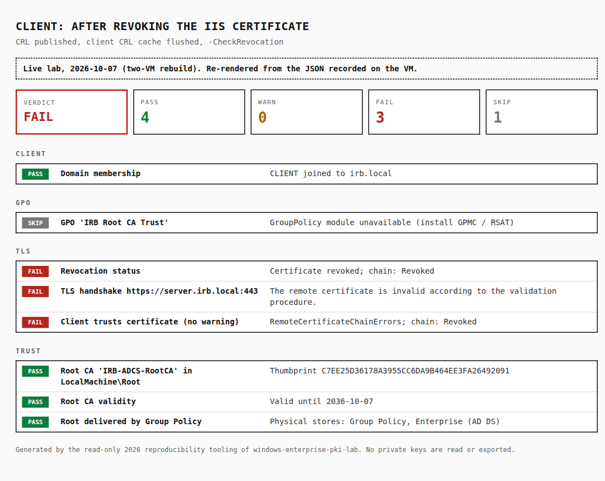 | 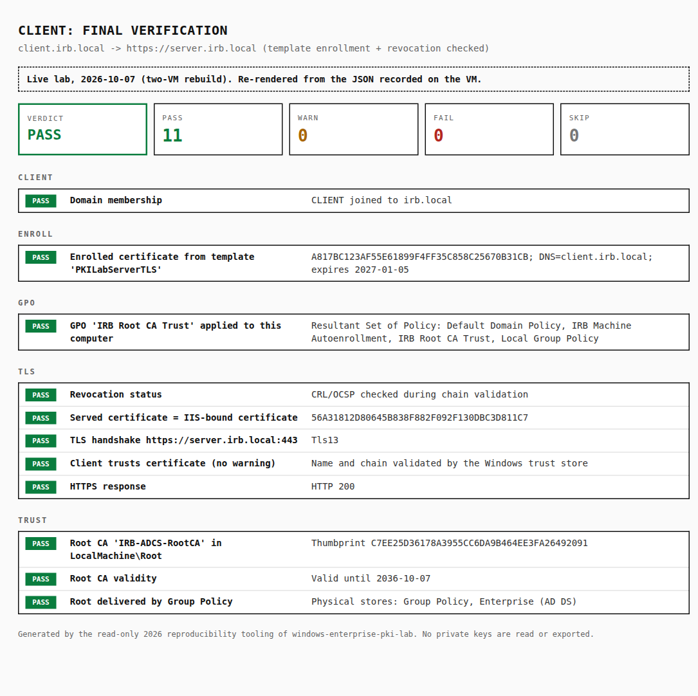 | 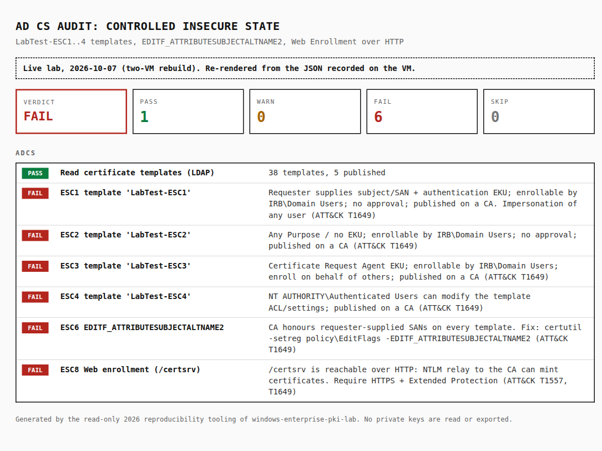 |

Reports re-rendered as HTML from the JSON recorded on the VMs. The insecure state was set up on
purpose by [`Set-AdcsAuditTestMatrix.ps1`](scripts/lab/Set-AdcsAuditTestMatrix.ps1), which only runs
with `-IsolatedLab` in `irb.local` and never requests a certificate. No exploitation tooling is included.

## AD CS security audit (2026)

> 2026 extension. Not run against the original lab, which did not record its templates. Run
> against the live rebuild's CA in a [controlled detection/remediation matrix](docs/live-lab.md#4-ad-cs-audit-matrix-detection-and-remediation).

A working PKI is not the same as a safe one. Misconfigured AD CS is one of the most common
paths to domain compromise: a low-privileged user requests a certificate *as someone else* and
authenticates with it ([MITRE ATT&CK T1649](https://attack.mitre.org/techniques/T1649/)).
[`scripts/audit-adcs.ps1`](scripts/audit-adcs.ps1) reviews the lab CA for the well-known
misconfiguration classes from SpecterOps' *Certified Pre-Owned*:

| ID | What is flagged | Data source |
|---|---|---|
| ESC1 | Requester supplies subject/SAN + authentication EKU + low-privileged enrollment, no approval | Template flags, EKUs, ACL (LDAP) |
| ESC2 | Any Purpose or no EKU, low-privileged enrollment | Template EKUs, ACL |
| ESC3 | Certificate Request Agent EKU, low-privileged enrollment | Template EKUs, ACL |
| ESC4 | Low-privileged principals can modify the template | Template ACL |
| ESC6 | `EDITF_ATTRIBUTESUBJECTALTNAME2` set on the CA | CA policy registry |
| ESC8 | Web Enrollment (`/certsrv`) reachable over HTTP, so NTLM relay is possible | IIS configuration |

"Low-privileged" means Everyone, Anonymous, Authenticated Users, BUILTIN\Users, Domain Users
and Domain Computers. Unpublished templates are reported as `WARN` (a latent risk), published ones
as `FAIL`. Deny ACEs are not subtracted, so a finding means *review*, not *confirmed exploit*.
The audit only reads; it never requests a certificate. ESC5 and ESC7 (CA object and officer
permissions) are not covered.

```powershell
.\scripts\audit-adcs.ps1                                    # exit 1 on any FAIL
.\scripts\audit-adcs.ps1 -OutputFormat Html -OutFile .\adcs-audit.html
```

ATT&CK mapping for the whole design: [`docs/security-model.md`](docs/security-model.md#attck-mapping-2026-extension).

## Verification report (2026)

`verify-pki.ps1` and `audit-adcs.ps1` can write a self-contained HTML report
(`-OutputFormat Html`). The sample below was rendered by
[`tools/New-SampleReport.ps1`](tools/New-SampleReport.ps1) from **fixture data**, run through the
same evaluator functions the scripts use. It is **not** a recorded run against the original lab.
`ESC1-Demo` is a deliberately vulnerable fixture template, included to show what a finding looks like.

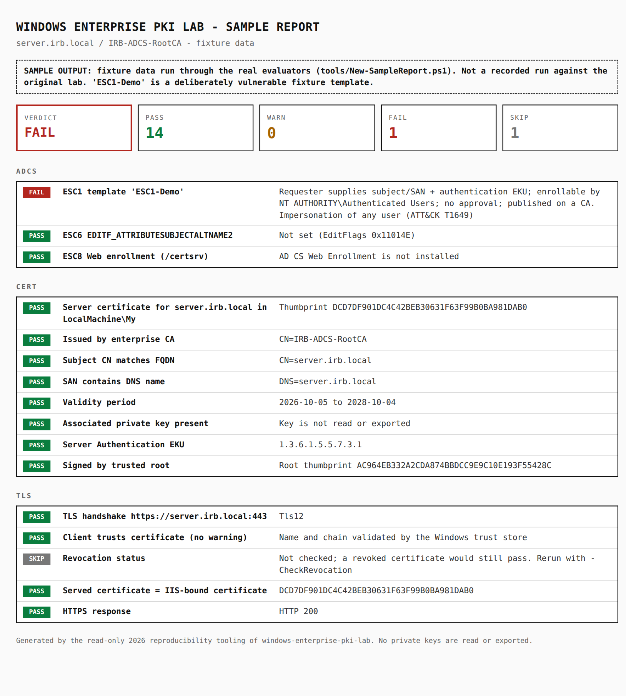

## Production target design (2026)

> Design only. Not implemented.

The live rebuild added a separate client, hardened auto-enrollment and a revocation test, but it is
still one online root CA. A production PKI needs more: an offline root, a
separate issuing CA, HSM-backed keys, reachable revocation, autoenrollment from hardened
templates, and monitoring. [`docs/target-architecture.md`](docs/target-architecture.md) compares
the lab with that target, gives a rollout order, and maps each control to a 2026 check.

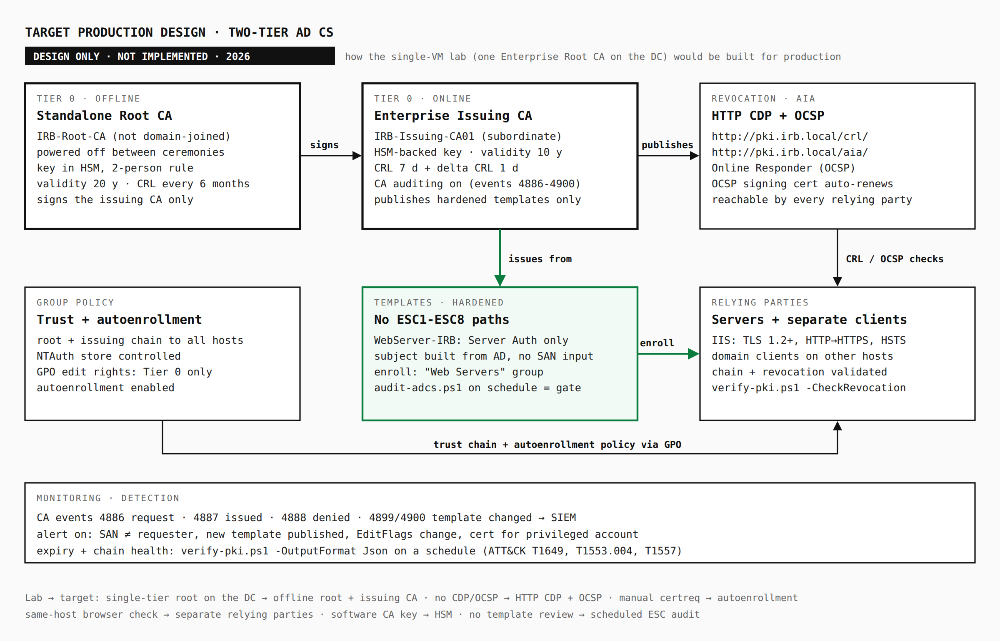

## Screenshots

All public screenshots come from the original May 2026 lab. Before publishing they were
**re-encoded with all metadata removed** (EXIF/XMP/ICC). One frame was cropped to remove the
hypervisor window. No student identifiers appear in any image.

| | |
|---|---|
| **01 Server Manager roles**<br><a href="docs/screenshots/01-server-manager-roles.png"></a> | **02 DNS A record**<br><a href="docs/screenshots/02-dns-a-record.png">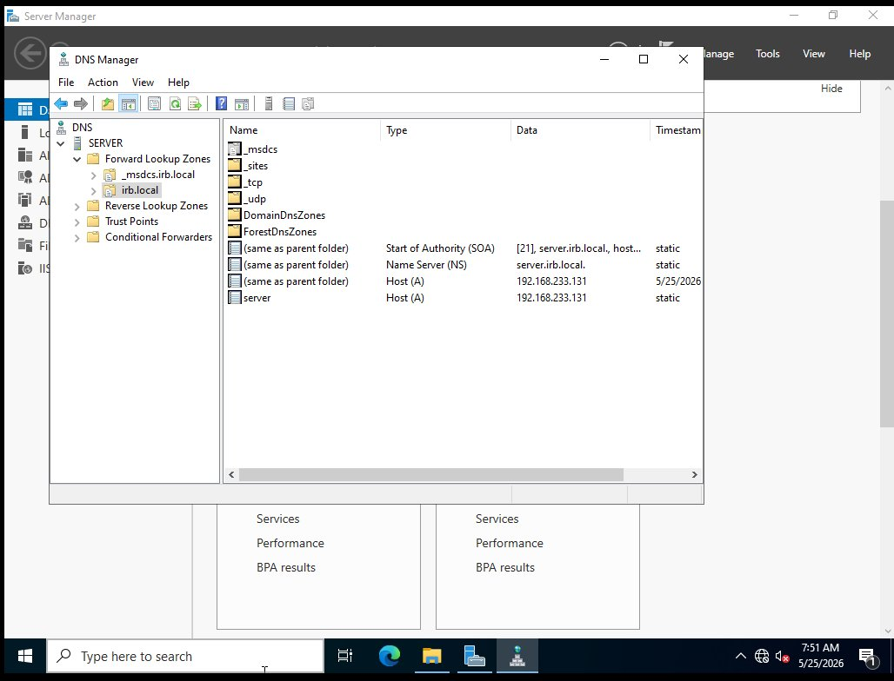</a> |
| **03 Enterprise Root CA**<br><a href="docs/screenshots/03-enterprise-root-ca.png"></a> | **04 GPO linked to irb.local**<br><a href="docs/screenshots/04-gpo-linked-to-domain.png"></a> |
| **05 GPO: Trusted Root CA**<br><a href="docs/screenshots/05-gpo-trusted-root-ca.png"></a> | **06 Local machine Trusted Root store**<br><a href="docs/screenshots/06-local-machine-trusted-root-store.png">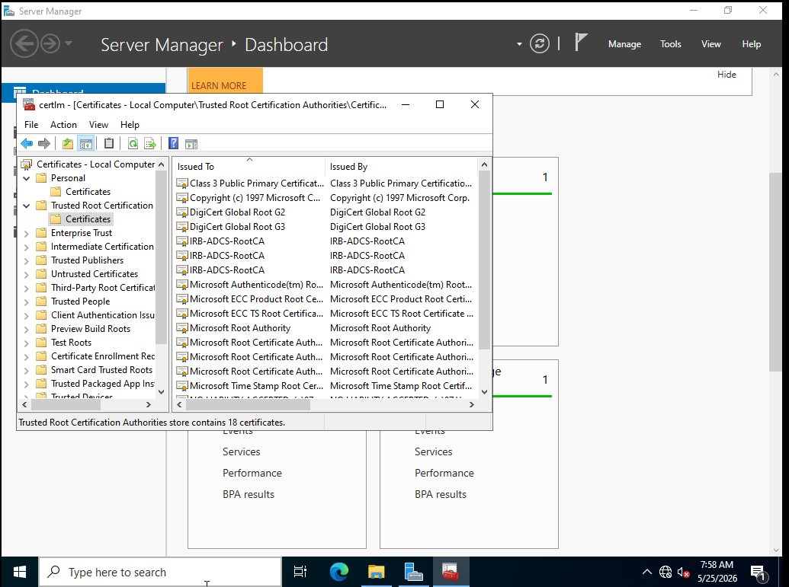</a> |
| **07 Machine certificate (Personal)**<br><a href="docs/screenshots/07-machine-certificate-personal-store.png"></a> | **08 IIS HTTPS :443 binding**<br><a href="docs/screenshots/08-iis-https-binding-443.png"></a> |
| **09 Edge: connection is secure**<br><a href="docs/screenshots/09-edge-connection-secure.png"></a> | **10 Certificate viewer**<br><a href="docs/screenshots/10-certificate-viewer-chain.png"></a> |

## Reproducibility

> **2026 REPRODUCIBILITY EXTENSION.** Created after the lab, not part of the original
> university submission. Nothing here was used to build the original environment.

The extension is **verification first**. Provisioning a domain controller or a CA is hard to
undo, so those steps stay documented manual steps rather than scripts.

| Path | Kind | What it does |
|---|---|---|
| [`scripts/verify-pki.ps1`](scripts/verify-pki.ps1) | **read-only** | Full evidence chain, `PASS` / `WARN` / `FAIL` / `SKIP` per check, exit code 1 on any FAIL, `-OutputFormat Json` / `Html`, `-CheckRevocation` |
| [`scripts/audit-adcs.ps1`](scripts/audit-adcs.ps1) | **read-only** | AD CS misconfiguration review: ESC1-ESC4 (templates), ESC6 (CA flag), ESC8 (web enrollment) |
| [`scripts/verify-domain.ps1`](scripts/verify-domain.ps1) | read-only | OS, roles, domain membership, DC role, DNS A record, static IP |
| [`scripts/verify-ca.ps1`](scripts/verify-ca.ps1) | read-only | `CertSvc` running, active CA name, CA type = Enterprise Root |
| [`scripts/verify-trust.ps1`](scripts/verify-trust.ps1) | read-only | Root in `LocalMachine\Root`, *which* physical store delivered it (Group Policy / Enterprise / local), GPO exists and is linked |
| [`scripts/verify-certificate.ps1`](scripts/verify-certificate.ps1) | read-only | Issuer, Subject, SAN, validity / expiry warning, private key present, Server Auth EKU, signature against the root |
| [`scripts/verify-iis-tls.ps1`](scripts/verify-iis-tls.ps1) | read-only | IIS https binding + bound thumbprint, live TLS handshake validated by the Windows trust store, HTTP status |
| [`scripts/verify-client.ps1`](scripts/verify-client.ps1) | read-only | From a domain **client**: membership, root delivered by Group Policy, GPO applied (GPMC or Resultant Set of Policy), `-TemplateName` auto-enrolled certificate, TLS to the server with `-CheckRevocation` |
| [`scripts/lab/Set-AdcsAuditTestMatrix.ps1`](scripts/lab/Set-AdcsAuditTestMatrix.ps1) | changes AD CS config · isolated lab only | Test fixture for the audit: `Insecure` / `Remediated` / `Removed`. Requires `-IsolatedLab` and domain `irb.local`; never requests a certificate |
| [`lab/live-rebuild/`](lab/live-rebuild/README.md) | lab build scripts | Host (QEMU/KVM, host-only network) and guest scripts used for the October 2026 two-VM rebuild |
| [`scripts/reproduce/Install-LabRoles.ps1`](scripts/reproduce/Install-LabRoles.ps1) | changes system · `-WhatIf` · confirm | Installs role binaries only (no promotion) |
| [`scripts/reproduce/New-ServerCertificateRequest.ps1`](scripts/reproduce/New-ServerCertificateRequest.ps1) | writes a file | `certreq` INF with Subject + SAN, non-exportable machine key |
| [`scripts/reproduce/Set-IisHttpsBinding.ps1`](scripts/reproduce/Set-IisHttpsBinding.ps1) | changes system · `-WhatIf` · confirm | Creates/updates the IIS https binding; only accepts a currently valid certificate with private key, SAN, Server Auth EKU and the expected issuer |
| [`tools/New-SampleReport.ps1`](tools/New-SampleReport.ps1) | writes a file | Renders `docs/sample-report.html` from fixture data |
| [`tools/Render-LiveEvidence.ps1`](tools/Render-LiveEvidence.ps1) | writes files | Renders the recorded live-lab JSON as HTML reports |

```powershell
# On server.irb.local, elevated Windows PowerShell 5.1 or PowerShell 7
Set-Location .\scripts
.\verify-pki.ps1
.\verify-pki.ps1 -OutputFormat Json > pki-report.json
.\verify-pki.ps1 -OutputFormat Html -OutFile .\pki-report.html
.\audit-adcs.ps1
```

Example console line format (illustrative, not a captured run):

```
[PASS] CERT     SAN contains DNS name - DNS=server.irb.local
[WARN] IIS      Plain HTTP binding - *:80: still served over HTTP (no redirect/HSTS configured by this lab)
[PASS] TLS      Client trusts certificate (no warning) - Name and chain validated by the Windows trust store
```

The full rebuild runbook (script steps and manual steps) is in [`docs/reproduce.md`](docs/reproduce.md).

**How the tooling is tested.** `tests/PkiLab.Tests.ps1` (56 Pester 5 tests) generates root CAs and
leaf certificates in memory (including a renewed root that reuses the CA name), uses fixture
templates and ACLs for every ESC rule, and mocks Windows-only cmdlets. It also runs a live local TLS server
to exercise the handshake check. CI runs PSScriptAnalyzer and Pester on PowerShell 7 (Linux,
Windows) and Windows PowerShell 5.1. The scripts were also run against the
[live two-VM rebuild](docs/live-lab.md) (October 2026). That is evidence from the rebuild, not from
the original May 2026 lab.

## Lessons / technical decisions

| Decision | Reason |
|---|---|
| **Enterprise Root CA** (not standalone) | Integrates the CA with AD DS so trust and issuance live in the domain's trust boundary. |
| **GPO-based trust distribution** | Domain computers trust the root without manual import on each machine. Central control, central removal. |
| **SAN-based certificate** | Browsers validate the host name against the SAN, so `DNS=server.irb.local` must match the name clients use. |
| **Machine (LocalMachine) certificate store** | The certificate identifies the *server*, not a user. IIS reads it from `LocalMachine\My`. |
| **HTTPS on port 443 with a host name** | Tests the whole chain in a real service: DNS → TLS → chain → browser UI. |
| **Static IP + local DNS** | AD DS and certificate names depend on stable name resolution. |
| *(2026)* **Audit for abuse, not just function** | A PKI that issues valid certificates can still let any user impersonate a domain admin. The ESC audit checks for that. |
| *(2026)* **Revocation is reported, not assumed** | Lab CAs often have no reachable CDP; the TLS check reports `Revocation status: SKIP` unless `-CheckRevocation` is used. |
| *(2026, live)* **A PASS is only as fresh as the client's CRL** | The revocation test showed a revoked certificate passing twice: the CRL was not published where IIS serves it, then the client used its cached CRL. Hence `-CheckRevocation`, explicit CDP publication, and OCSP in the target design. |
| *(2026, live)* **Least-privilege template, not a duplicated default** | Enroll/AutoEnroll granted to one group, subject from AD, one EKU, non-exportable key, and all other templates unpublished. `audit-adcs.ps1` passes on it. |
| *(2026)* **Verification over provisioning** | Read-only checks are safe to run repeatedly. Automating DC promotion and CA setup is fragile and hard to undo. |

## Limitations

**Original May 2026 lab** (unchanged; the live rebuild does not rewrite it):

- Single lab VM: CA, DC, DNS, IIS and the browser all run on `server.irb.local`.
- No certificate template recorded; the certificate was requested manually with `certreq`.
- GPO trust delivery to a *separate* client and revocation were not tested.
- Two `server.irb.local` certificates are present in the Personal store (likely a repeated request). Only the IIS-bound one matters, but cleanup was not documented.

Closed by the [October 2026 live rebuild](docs/live-lab.md): separate-client GPO trust,
hardened template + auto-enrollment, revocation, live AD CS audit matrix.

**Still open, in both:**

- Single-tier PKI: online Enterprise Root CA issues directly. The offline root + issuing CA is [design only](docs/target-architecture.md).
- No HSM; CA keys are software keys on the CA host.
- No OCSP responder; revocation is a CRL over HTTP.
- Auto-renewal configured but not observed (would need to wait until 7 days before the 90-day expiry).
- `http :80` stayed bound: no HTTP→HTTPS redirect, no HSTS, no TLS cipher/protocol hardening review.
- Evaluation VMs on an isolated network. **Not** a production PKI and not a production hardening assessment.

## Repository provenance

| | Original lab | 2026 reproducibility extension | 2026 live rebuild |
|---|---|---|---|
| **When** | May 2026 (report dated 2026-05-25) | October 2026 | 2026-10-07 |
| **What** | Manual configuration in Windows Server 2022 GUI/CLI, documented in a PDF report with screenshots | This repository: docs, diagrams, sanitized screenshots, PowerShell verification + AD CS audit + helper scripts, HTML report, target design, tests, CI | New server + client VMs built from evaluation media; separate-client trust, auto-enrollment, revocation and audit matrix, with raw output in [`evidence/live-2026-10-07/`](evidence/live-2026-10-07/README.md) |
| **Source code / Git history** | None. The lab had no repository, scripts or infrastructure-as-code. | First commit in this repository, October 2026. No backdated history. | Scripts in [`lab/live-rebuild/`](lab/live-rebuild/README.md), committed with the evidence |

The unsanitized original report is **not** published. See [`original-lab/README.md`](original-lab/README.md)
for what was in it and how the public evidence was selected and sanitized.

## License

[MIT](LICENSE) for the scripts and documentation. Screenshots are original lab captures by the author.
