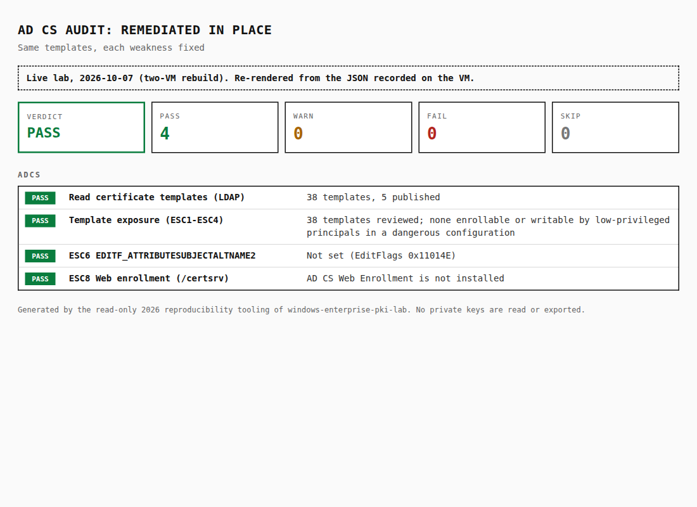

# Live two-VM rebuild (October 2026)

> **2026 LIVE-LAB EXTENSION.** Everything on this page was run on 2026-10-07 on two freshly
> installed evaluation VMs. It is **not** the original May 2026 lab, which ran on one VM and is
> documented in the [README](../README.md). Each claim links to the raw output it is based on in
> [`evidence/live-2026-10-07/`](../evidence/live-2026-10-07/README.md).

## Why

The original lab showed the trust chain on a single server: Edge ran on the CA/DC itself, no
template was recorded and nothing was ever revoked. That leaves four open questions:

1. Does GPO actually deliver root trust to a **separate** domain member?
2. Does the tooling report a **revoked** certificate correctly, not just a valid one?
3. Can a domain machine get its certificate **automatically** from a **hardened** template?
4. Does `audit-adcs.ps1` detect real AD CS misconfigurations, and clear once they are fixed?

## Lab

```
host-only bridge 192.168.77.0/24 (no NAT, no internet)
│
├── SERVER  192.168.77.10  Windows Server 2022 Standard (evaluation)
│     AD DS + DNS (irb.local) · AD CS Enterprise Root CA IRB-ADCS-RootCA (RSA 3072, SHA256, 10 y)
│     IIS https :443 + HTTP CDP/AIA at http://server.irb.local/pki/
│     GPOs: "IRB Root CA Trust", "IRB Machine Autoenrollment" (AEPolicy = 7)
│     Template: PKILabServerTLS (the only template published on the CA)
│
└── CLIENT  192.168.77.20  Windows 11 Enterprise LTSC (evaluation), domain member
      Gets root trust and its certificate by Group Policy only, then validates https://server.irb.local
```

Both VMs were installed unattended from Microsoft evaluation ISOs (hashes:
[`00-media-sha256.txt`](../evidence/live-2026-10-07/00-media-sha256.txt)) with QEMU/KVM. The host scripts and the guest
scripts are in [`lab/live-rebuild/`](../lab/live-rebuild/README.md). Passwords, unattend files,
disks and ISOs stay outside the repository.

The tooling was copied to the VMs as-is from this repo and run there. The verifier reports below
are what it printed on the VMs.

## 1. GPO trust on a separate client

| Step | Result | Evidence |
|---|---|---|
| Client in WORKGROUP, before joining | **4 FAIL, 2 SKIP**: not a member, root not trusted, TLS fails with `UntrustedRoot` | [`01-client-before-domain.txt`](../evidence/live-2026-10-07/01-client-before-domain.txt) |
| Joined, before `gpupdate` | Group Policy root store empty | [`02-…-before-gpupdate.json`](../evidence/live-2026-10-07/02-client-policy-roots-before-gpupdate.json) |
| After join + `gpupdate` | `IRB Root CA Trust` in the applied GPO list; root `C7EE25D3…2091` in the **Group Policy** physical store | [`02-client-gpo-trust.txt`](../evidence/live-2026-10-07/02-client-gpo-trust.txt), [`02-…-after-gpupdate.json`](../evidence/live-2026-10-07/02-client-policy-roots-after-gpupdate.json) |

The verifier's trust check reads *which physical store* holds the root, so a root imported by hand
into the local store would not count as "delivered by Group Policy".

A Windows client has no GroupPolicy (GPMC) module, so `verify-client.ps1` first reported the GPO
check as SKIP. It now falls back to the computer's Resultant Set of Policy (`root/rsop/computer`)
and passes only if the GPO is actually applied (final run: [`19-client-verify-final.txt`](../evidence/live-2026-10-07/19-client-verify-final.txt)).

## 2. Hardened template and GPO auto-enrollment

`PKILabServerTLS` was created by [`04-configure-template.ps1`](../lab/live-rebuild/guest/04-configure-template.ps1).
Template report: [`04-template-pkilabservertls.txt`](../evidence/live-2026-10-07/04-template-pkilabservertls.txt).

| Control | Setting |
|---|---|
| Subject / SAN | Built from AD: DNS name as CN + DNS SAN (`msPKI-Certificate-Name-Flag 0x18000000`). `ENROLLEE_SUPPLIES_SUBJECT` **not** set, so no requester-supplied SAN (closes ESC1). |
| EKU | Server Authentication (`1.3.6.1.5.5.7.3.1`) only. No Any Purpose, no Client Auth, no Request Agent. |
| Key | 2048-bit minimum, **not exportable** |
| Lifetime | 90 days, renewal 7 days before expiry |
| Enroll / AutoEnroll | Only the `PKITLSAutoenroll` group (members: `SERVER`, `CLIENT`). Authenticated Users: read only. Write: SYSTEM, Domain Admins, Enterprise Admins. |
| CA | All default templates unpublished; `PKILabServerTLS` is the only published template. |
| Issuance | Machine auto-enrollment by GPO `IRB Machine Autoenrollment` (`AEPolicy = 7`: enroll, renew, update) |

Result: no manual request on either machine (`certreq` was only used later, for the replacement in step 16). After `gpupdate` + `certutil -pulse`:

| Machine | Certificate | Evidence |
|---|---|---|
| SERVER | `2180CD9A…6161`, CN/SAN `server.irb.local`, Server Auth, key not exportable, 2048-bit. Bound to IIS :443. | [`05-server-autoenrollment.json`](../evidence/live-2026-10-07/05-server-autoenrollment.json), [`05-server-ca-issuance-and-events.txt`](../evidence/live-2026-10-07/05-server-ca-issuance-and-events.txt) |
| CLIENT | `A817BC12…31CB`, CN/SAN `client.irb.local`, same properties | [`06-client-autoenrollment.json`](../evidence/live-2026-10-07/06-client-autoenrollment.json), [`06-client-gpresult.txt`](../evidence/live-2026-10-07/06-client-gpresult.txt) |

`verify-client.ps1 -TemplateName PKILabServerTLS` checks this on the client: a currently valid
certificate whose template extension names exactly that template, issued by the lab CA, with the
machine's DNS name in the SAN, Server Auth EKU and a private key.

## 3. Revocation lifecycle

| # | Step | Verifier on CLIENT (`-CheckRevocation`) | Evidence |
|---|---|---|---|
| 07 | Valid auto-enrolled certificate on IIS | **9 PASS** | [`07`](../evidence/live-2026-10-07/07-client-verify-before-revocation.txt) |
| 08 | Revoke serial `…0003` (reason Key Compromise) on the CA, publish CRL | | [`08`](../evidence/live-2026-10-07/08-server-revoke-and-publish-crl.txt) |
| 09 | Client checks again | still **PASS**: the CRL served over HTTP was old | [`09`](../evidence/live-2026-10-07/09-client-verify-revoked-stale-http-crl.txt) |
| 10 | Root cause: the CA wrote CRLs only to `CertEnroll`, not to the folder IIS serves. CDP publication fixed, CRL 6 published; `openssl crl` on the host shows the serial as revoked (Key Compromise) in the CRL served over HTTP | | [`10`](../evidence/live-2026-10-07/10-server-cdp-publication-fix.txt), [`10-openssl`](../evidence/live-2026-10-07/10-served-crl-openssl.txt) |
| 11 | Client checks again | still **PASS**: Windows uses its cached CRL until `NextUpdate` | [`11`](../evidence/live-2026-10-07/11-client-verify-revoked-cached-crl.txt) |
| 12 | Flush the client CRL cache | | [`12`](../evidence/live-2026-10-07/12-client-crl-cache-flush.txt) |
| 13 | Client checks again | **3 FAIL**: `Revocation status: Certificate revoked; chain: Revoked`, handshake rejected, not trusted | [`13`](../evidence/live-2026-10-07/13-client-verify-revoked.txt) |
| 14 | Same, **without** `-CheckRevocation` | 7 PASS, revocation **SKIP** with "a revoked certificate could still pass" | [`14`](../evidence/live-2026-10-07/14-client-verify-revoked-without-checkrevocation.txt) |
| 15 | Server checks itself (`verify-pki.ps1`) after flushing its cache | 29 PASS, 2 WARN, **3 FAIL** (same three) | [`15`](../evidence/live-2026-10-07/15-server-verify-revoked.txt) |
| 16 | New certificate `56A31812…11C7` from the template, bound to IIS; revoked one removed | | [`16`](../evidence/live-2026-10-07/16-server-replace-iis-certificate.txt) |
| 17 | Client checks again | **9 PASS**, served certificate = new IIS-bound one | [`17`](../evidence/live-2026-10-07/17-client-verify-after-replacement.txt) |
| 18 | Server full check | **33 PASS, 2 WARN, 0 FAIL** | [`18`](../evidence/live-2026-10-07/18-server-verify-after-replacement.txt) |
| 19 | Final client check with `-TemplateName PKILabServerTLS -CheckRevocation` | **11 PASS, 0 WARN, 0 FAIL, 0 SKIP** | [`19`](../evidence/live-2026-10-07/19-client-verify-final.txt) |

| Client after revocation (13) | Client final (19) |
|---|---|
|  |  |

Steps 09 and 11 matter more than the clean result. A relying party trusted a revoked certificate
twice: once because of a CDP publication mistake, and once because CRL caching is working as
designed. The verifier uses the Windows chain engine, so it reports what a Windows client would
actually do at that moment. That is deliberate, but it means a PASS is only as fresh as the CRL the
client holds. The [target design](target-architecture.md) adds OCSP and shorter CRL periods for
this reason.

The two server WARNs are expected: a second `server.irb.local` certificate is still in
`LocalMachine\My` (the verifier evaluates the IIS-bound one), and `http :80` is still bound.

## 4. AD CS audit matrix (detection and remediation)

[`scripts/lab/Set-AdcsAuditTestMatrix.ps1`](../scripts/lab/Set-AdcsAuditTestMatrix.ps1) puts the
lab CA into three states. It refuses to run unless `-IsolatedLab` is passed and the domain is
`irb.local`. It only changes configuration: it never requests, issues or uses a certificate, and
nothing in this repository exploits a finding.

Each state was checked twice: by `audit-adcs.ps1` and by an independent ground-truth dump of the
raw AD attributes, CA registry and installed roles
([`11-audit-matrix-ground-truth.ps1`](../lab/live-rebuild/guest/11-audit-matrix-ground-truth.ps1)).

| Weakness set up on purpose | Insecure | Remediated in place | Templates removed |
|---|---|---|---|
| ESC1 `LabTest-ESC1`: requester supplies subject, Client Auth EKU, Domain Users enroll | **FAIL** | PASS (subject built from AD) | PASS |
| ESC2 `LabTest-ESC2`: Any Purpose EKU, Domain Users enroll | **FAIL** | PASS (CA manager approval required) | PASS |
| ESC3 `LabTest-ESC3`: Certificate Request Agent EKU, Domain Users enroll | **FAIL** | PASS (Domain Users enroll removed) | PASS |
| ESC4 `LabTest-ESC4`: Authenticated Users have WriteDacl | **FAIL** | PASS (ACE removed) | PASS |
| ESC6 `EDITF_ATTRIBUTESUBJECTALTNAME2` on the CA | **FAIL** | PASS (flag cleared) | PASS |
| ESC8 Web Enrollment `/certsrv` over HTTP (`401 Negotiate, NTLM`) | **FAIL** | PASS (role removed, `404`) | PASS |
| Audit summary | 1 PASS, **6 FAIL** | 4 PASS | 4 PASS |
| Evidence | [audit](../evidence/live-2026-10-07/audit-matrix/1-insecure-audit.json) · [ground truth](../evidence/live-2026-10-07/audit-matrix/1-insecure-ground-truth.txt) · [HTTP](../evidence/live-2026-10-07/audit-matrix/1-insecure-esc8-http-probe.txt) | [audit](../evidence/live-2026-10-07/audit-matrix/2-remediated-audit.json) · [ground truth](../evidence/live-2026-10-07/audit-matrix/2-remediated-ground-truth.txt) · [HTTP](../evidence/live-2026-10-07/audit-matrix/2-remediated-esc8-http-probe.txt) | [audit](../evidence/live-2026-10-07/audit-matrix/3-removed-audit.json) · [state](../evidence/live-2026-10-07/audit-matrix/3-removed-state.txt) |

In the remediated state the templates are still there and still published. That shows the audit
reacts to the specific setting, not to a template's name or existence. Baseline before the
matrix (only `PKILabServerTLS` published) also passed: [`03-audit-baseline.json`](../evidence/live-2026-10-07/03-audit-baseline.json).

| Insecure | Remediated |
|---|---|
|  |  |

## Problems found and fixed during the rebuild

| Problem | Fix |
|---|---|
| Revoked certificate still accepted over HTTP (CRL not copied to the IIS-served folder) | CDP publication list includes `C:\pki\publication` ([`10`](../evidence/live-2026-10-07/10-server-cdp-publication-fix.txt)); [`02-configure-ca.ps1`](../lab/live-rebuild/guest/02-configure-ca.ps1) now sets it from the start |
| Revoked certificate still accepted from the client's CRL cache | Documented; cache flushed for the test ([`08-flush-crl-cache.ps1`](../lab/live-rebuild/guest/08-flush-crl-cache.ps1)) |
| `verify-client.ps1` could only SKIP the GPO check on a client without GPMC | RSoP fallback (`Get-LabAppliedGpoName`), with tests |
| No way to check auto-enrollment from the verifier | `-TemplateName` / `Test-LabEnrolledCertificate`, with tests |
| First Windows 11 client stuck in Automatic Repair after a restart; automatic device encryption had encrypted the disk | Client reinstalled with device encryption disabled in the unattend file, re-joined and re-tested. All client evidence is from the second install. |

## What this still does not show

- Single-tier PKI: the root CA is online and issues directly. The [offline root + issuing CA
  design](target-architecture.md) is still **design only**.
- No OCSP responder; revocation relies on a CRL over HTTP.
- No HSM; software CA key.
- No HTTP→HTTPS redirect or HSTS; `http :80` still bound.
- Auto-*renewal* was configured (`AEPolicy = 7`, 7-day overlap) but not observed. That would mean
  waiting until 7 days before the 90-day expiry.
- Evaluation VMs on a host-only network. Not a production environment and not a cloud deployment.
